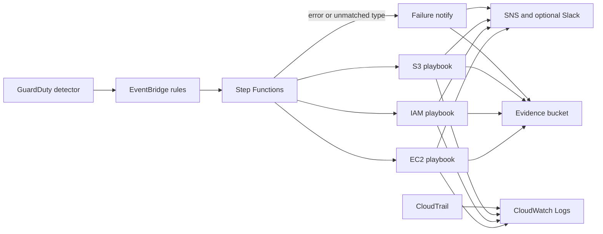

# Incident Response Automation Lab

**This stack creates real AWS resources and, in `enforce` mode, can quarantine EC2 instances, deactivate IAM access keys, and block public S3 access. Deploy it only in a sandbox account.**

GuardDuty (or an existing detector) publishes findings. EventBridge selects them by type and severity. Step Functions routes each finding to a least-privilege Python playbook. The playbook contains the resource, writes an evidence object, and notifies SNS, with an optional Slack webhook. CloudTrail, CloudWatch Logs, and a KMS-encrypted evidence bucket keep the audit trail.

The original lab brief was: detect with GuardDuty, isolate a compromised instance, snapshot its volumes, tag it, notify, and orchestrate that sequence. This repository implements that sequence and adds IAM credential and S3 public-access playbooks.

## Architecture



A forensics VPC is created with no internet gateway and a closed network ACL. It is where you attach a volume restored from a forensic snapshot. The playbooks do not move instances into it.

## Playbooks

| Finding types | Playbook | Automated action | Notification |
| --- | --- | --- | --- |
| `:EC2/` such as `CryptoCurrency:EC2/*`, `Recon:EC2/*`, `UnauthorizedAccess:EC2/*` | `ec2_compromise` | Replace security groups with a quarantine group, tag the instance, snapshot attached EBS volumes | SNS, optional Slack, evidence JSON |
| `:IAMUser/` such as `UnauthorizedAccess:IAMUser/MaliciousIPCaller.Custom` | `iam_compromise` | Deactivate the access key and attach only the pre-created deny-all policy | SNS, optional Slack, evidence JSON |
| `:S3/` such as `Exfiltration:S3/*`, `Policy:S3/BucketAnonymousAccessGranted` | `s3_exfiltration` | Enable all four S3 Block Public Access settings and tag the bucket | SNS, optional Slack, evidence JSON |
| Unmatched type, or a playbook exception | `failure_notify` | No containment | SNS, optional Slack, evidence JSON |

`containment_mode = notify_only` records the action and does not change the resource. Findings below `min_severity` are written to evidence and are not notified. Root users and assumed roles are reported as manual follow-up. Runbooks:

- [EC2 compromise](docs/runbooks/ec2-compromise.md)
- [IAM credentials](docs/runbooks/iam-credential-compromise.md)
- [S3 exfiltration or public bucket](docs/runbooks/s3-exfiltration.md)

## NIST SP 800-61

| Phase | What this lab implements |
| --- | --- |
| Preparation | Terraform, least-privilege roles, deny-all policy, quarantine group pattern, evidence bucket, forensics VPC, runbooks |
| Detection and analysis | GuardDuty, EventBridge severity and type rules, finding parser, region and account guards |
| Containment, eradication, and recovery | Quarantine, snapshot, key deactivation, deny-all, Block Public Access, runbook rollback |
| Post-incident activity | Evidence objects, Step Functions history, CloudTrail, CloudWatch Logs, IR tags, DLQ alarm |

Detail is in [docs/nist-800-61.md](docs/nist-800-61.md). The step-by-step exercise is [docs/lab-walkthrough.md](docs/lab-walkthrough.md).

## Prerequisites

- A sandbox AWS account. Do not point this at production.
- Terraform 1.6 or newer and AWS CLI v2.
- Python 3.12 to run the tests or the simulation script.
- An email address for the SNS subscription.

## Deploy

```bash
cd terraform
cp terraform.tfvars.example terraform.tfvars
# edit notification_email, region, and containment_mode
terraform init
terraform plan
terraform apply
```

Confirm the SNS subscription email. Local state is the default. A commented S3 backend and DynamoDB lock example is in [terraform/backend.tf](terraform/backend.tf).

Tear down with `terraform destroy` from the `terraform/` directory. The KMS key remains pending deletion for 7 days. Terminate any instance you launched for the exercise.

## Cost

A quiet sandbox is usually a few dollars a month after the GuardDuty trial, plus the KMS key.

| Resource | What to expect |
| --- | --- |
| GuardDuty | 30-day trial, then per-GB and per-event charges. S3 protection is a separate feature and is on by default. |
| KMS | One customer managed key, about $1 per month plus requests. Deletion takes 7 days. |
| CloudTrail | The first management-event trail in the account is free. A second trail is not. Set `enable_cloudtrail = false` if you already have one. |
| Lambda, Step Functions, EventBridge, SNS, CloudWatch | Negligible at lab volume. Log retention is 365 days. |
| S3 | Evidence transitions to Standard-IA after 30 days and expires after 365. Small objects can incur the Standard-IA minimum. |
| Forensics VPC | No NAT gateway and no VPC endpoints, so no hourly network charge. |
| Exercise EC2 | Only if you launch one. Stop or terminate it. |

## Sample findings

Samples are the safe way to test the pipeline. They do not scan ports, mine cryptocurrency, or call AWS APIs as an attacker.

```bash
AWS_REGION=us-east-1 ./scripts/generate_sample_findings.sh
```

The script calls `guardduty create-sample-findings` for one high EC2 finding, one low EC2 finding, one IAM finding, and two S3 findings. Placeholder resource IDs produce playbook status `resource_not_found`, an alert, and an evidence object.

`min_severity` defaults to 1 so the low port-probe sample is included. Set it to 4 after the tour if you want a medium-and-above filter. `Policy:S3/BucketBlockPublicAccessDisabled` is low and would be filtered at 4. `Policy:S3/BucketAnonymousAccessGranted` would not.

To contain a resource you own, without generating an attack:

```bash
python scripts/simulate_finding.py --playbook ec2 --instance-id i-0123456789abcdef0
python scripts/simulate_finding.py \
  --playbook ec2 \
  --instance-id i-0123456789abcdef0 \
  --region us-east-1 \
  --state-machine-arn arn:aws:states:us-east-1:123456789012:stateMachine:ir-lab-incident-response \
  --execute
```

Without `--execute` the script prints JSON and stops. With `--execute` it refuses to start unless that instance exists in the region.

## Tests and CI

GitHub Actions runs ruff, pytest, `terraform fmt`, `terraform validate`, tflint, and checkov on push and pull request. CI does not apply the stack and does not need AWS credentials.

```bash
python -m pip install -r requirements-dev.txt
ruff check lambdas tests scripts
ruff format --check lambdas tests scripts
pytest -q
```

`make ci` also runs `terraform validate`, tflint, and checkov when those tools are installed. Playbook tests use moto for EC2, IAM, and S3, and a botocore stub for the SNS publish call.

## Configure before the first apply

- AWS credentials for the sandbox account (`AWS_PROFILE` or environment variables). Nothing in this repo is a credential.
- `terraform/terraform.tfvars`, copied from `terraform.tfvars.example`. It is gitignored. Set `notification_email`.
- Confirm the SNS subscription after apply.
- Optional `slack_webhook_url`. It is stored as an SSM SecureString and also in Terraform state. Use the commented remote backend if that state should be encrypted and locked.
- Optional `quarantine_ssh_cidr`. Leave it empty unless an analyst must reach a quarantined instance.
- `create_guardduty_detector = false` and `existing_detector_id` when the region already has a detector.
- `enable_cloudtrail = false` when you do not want another trail.
- `containment_mode`. Use `notify_only` for a rehearsal, then `enforce` for the exercise.
- Remote state only after the bucket and lock table exist. Uncomment [terraform/backend.tf](terraform/backend.tf) and run `terraform init -migrate-state`.

## Layout

```text
lambdas/src/ir_automation   playbook package deployed to Lambda
tests                       pytest suite
terraform                   root module and modules
scripts                     sample findings and synthetic events
docs/runbooks               one runbook per playbook
.github/workflows/ci.yml    lint, tests, validate, tflint, checkov
```

Jira ticket creation from the original brief is not implemented. The failure and success notifications are the extension point for a ticket system, and they do not require another credential in this lab.
